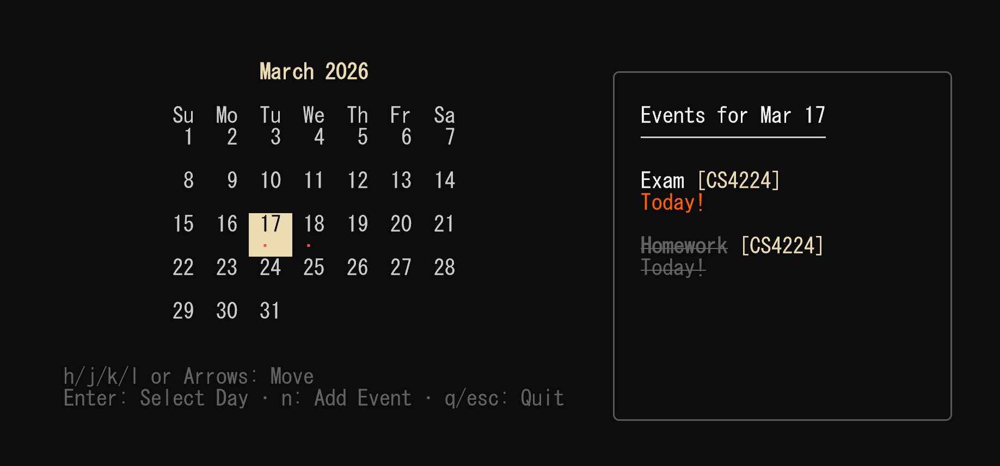
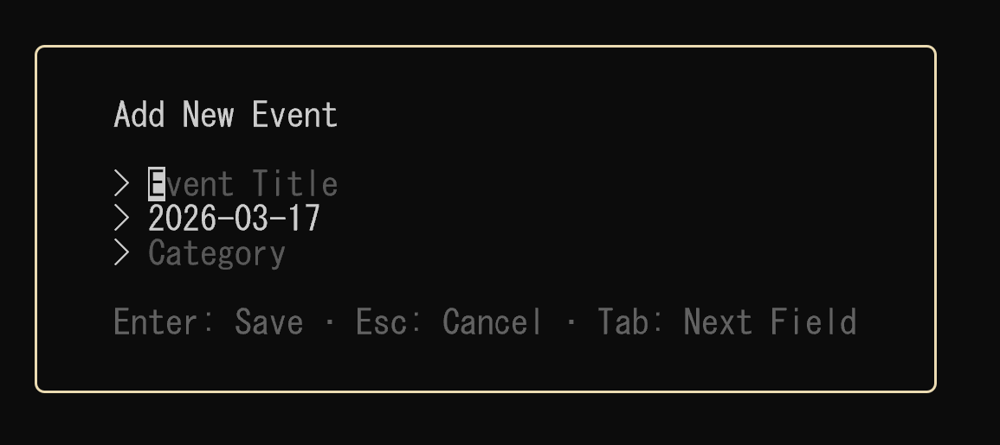

# Terminal Calendar


A beautiful, interactive calendar widget for your terminal, written in Go using the [Bubble Tea](https://github.com/charmbracelet/bubbletea) framework.

## Features

- **Interactive Calendar Grid:** Navigate smoothly through months and days using intuitive keybinds.
- **Event Tracking:** Create events with titles, categories, and dates.
- **Visual Indicators:** Days with events are clearly marked with a bullet point (`•`) beneath the date.
- **Side Panel Details:** Selecting a date displays a sleek sidebar detailing all events occurring on that day, including relative countdowns (e.g., "Tomorrow", "In 5 days", "Yesterday").
- **Persistent Storage:** Events are automatically saved and loaded from a local `events.json` file.
- **Event Management:** Add new events via a built-in form and delete existing events with a safety confirmation prompt.

## Prerequisites

- [Go](https://go.dev/dl/) 1.18 or higher

## Installation & Running

1. Clone or download this repository.
2. Navigate to the project directory in your terminal.
3. If dependencies aren't downloaded yet, initialize them:
   ```bash
   go mod init terminalcalendar
   go get github.com/charmbracelet/bubbletea github.com/charmbracelet/lipgloss github.com/charmbracelet/bubbles
   go mod tidy
   ```
4. Run the application:
   ```bash
   go run .
   ```
   *Alternatively, you can build an executable binary using `go build` and run `./terminalcalendar`.*

   If you would like the application to automatically `git pull` when it opens and `git push` when it closes without requiring you to use the manual keybinds, you can append the `-autosync` flag!
   ```bash
   go run . -autosync
   ```

## Syncing Events

To sync your events with your GitHub repository manually, press `s` while on the calendar view to execute `git push`, or press `p` to execute `git pull`. 

In order for syncing to work properly (whether automated via `-autosync` or triggered by the manual keybinds), you must run the application inside a git repository with a remote configured. If you wish to keep your events local, do not press `s`.

## Keybinds

### Calendar View
| Key | Action |
| --- | --- |
| `h` / `Left Arrow` | Move cursor one day backward |
| `l` / `Right Arrow` | Move cursor one day forward |
| `k` / `Up Arrow` | Move cursor one week backward |
| `j` / `Down Arrow` | Move cursor one week forward |
| `Enter` | **Select Day** (opens Day View if events exist, Add Event form otherwise) |
| `n` | Open the "Add Event" form (auto-fills current selected date) |
| `s` | **Sync Events** (executes git add, commit, and push on events.json) |
| `p` | **Pull Events** (executes git pull to update events from the remote repo) |
| `q` / `Esc` / `Ctrl+C` | Quit the application |

### Day View 
| Key | Action |
| --- | --- |
| `Up` / `Down` | Traverse through multiple events on the active day |
| `Spacebar` | Mark the highlighted event as Completed (draws a strikethrough) |
| `e` | Drop the highlighted event into the Edit Event menu to modify it |
| `d` / `x` | Prompt the Delete Confirmation menu for the highlighted event |
| `Esc` / `Left arrow` | Close the Day View and return focus to the calendar board |

### Add Event Form



| Key | Action |
| --- | --- |
| `Tab` | Move to the next input field |
| `Shift+Tab` | Move to the previous input field |
| `Enter` | Save the event |
| `Esc` | Cancel and return to calendar view |

### Delete Event Modal
| Key | Action |
| --- | --- |
| `y` / `Enter` | Confirm deletion |
| `n` / `Esc` | Cancel deletion |
